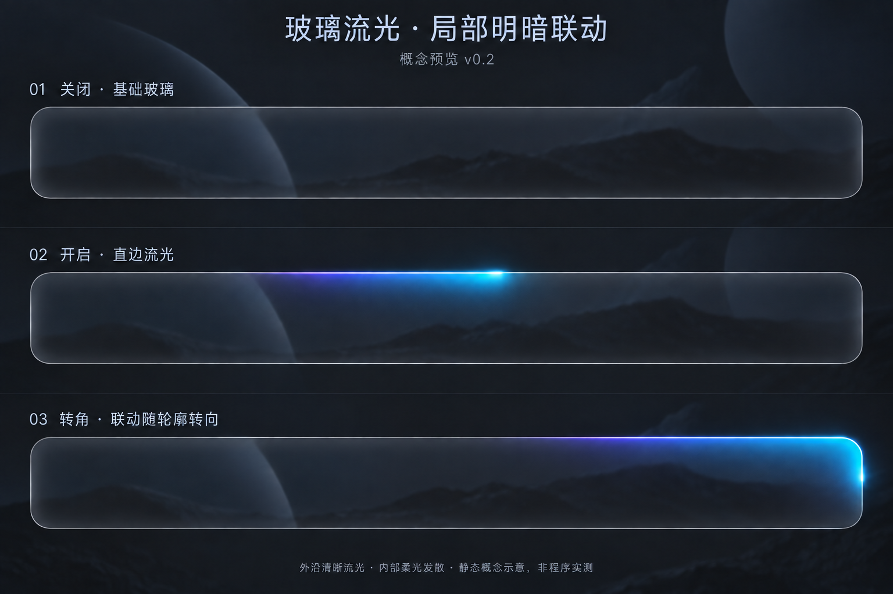

# 流光视觉 review v0.2

日期：2026-09-14。状态：**VISUAL_DIRECTION_CONFIRMED / implementation_not_verified**。关联 [升级方案 v1.3](../背景自适应深色材质升级方案-v1.3.md)。没有修改产品代码、构建或 ZIP，没有执行动画或性能验收。

## 参考与输出

用户选择 [第一张流光概念图](border-flow-concept-v0.1-user-reference.png) 的外沿亮度和整体协调性，并要求内部映射改为柔光模糊发散、不能出现第二条线。当前 [柔光映射概念图 v0.2](border-flow-soft-spill-v0.2.png) 由内置 imagegen 基于该指定图片编辑；未采用降低亮头的中间版本。完整生成与修正提示词见 [prompt 记录](border-flow-prompts.md)。

## 静态视觉检查

| 项目 | 观察与结论 |
|---|---|
| 外沿流光 | 保留单束冰蓝亮头及青紫尾迹；局部突出，其他边缘仍为中性。符合用户选择的方向，但亮头精确强度尚未标定。 |
| 内侧映射 | 当前可看到从高光向内渐隐的柔光，未看到清晰、平行的第二条彩色内轮廓；比首图更接近用户此次修正。 |
| 转角 | 柔光随右上角向内展开，没有用另一条完整 L 形细线描边。该区域发散较宽，亮度/宽度仍需按公式渲染后检查，防止过强。 |
| 内阴影 | 没有明显黑条或黑斑；单凭此背景无法分离证明独立阴影映射是否充分。不得为了证明“有阴影”重新画出暗带。 |
| 基础材质 | 没有整圈变成彩色，但生成图不是固定输入的像素级 A/B，不能证明关闭后精确恢复基础。 |
| 尺寸 | 图中主体约为 9:1，仍非严格 8:1；只用于光效方向讨论。正式静态渲染必须保持主体 800×100 px。 |
| 运动/性能 | 三个状态不证明动画匀速、循环连续、映射同步或低功耗。需要真实动态预览与固定构建测量。 |

结论：**用户已通过“welldone，更新升级文档”确认本版柔光发散的视觉方向。** 上表几何偏差及动态/参数验证限制继续保留，不因方向确认改为通过。 后续按升级方案 v1.3 的最小验证执行：观察一整圈、一次拖动和缩放的相位冻结/恢复及一次开关/隐藏。此 review 不额外要求四组对照或完整矩阵；已确认的柔光方向和几何要求继续保留。
