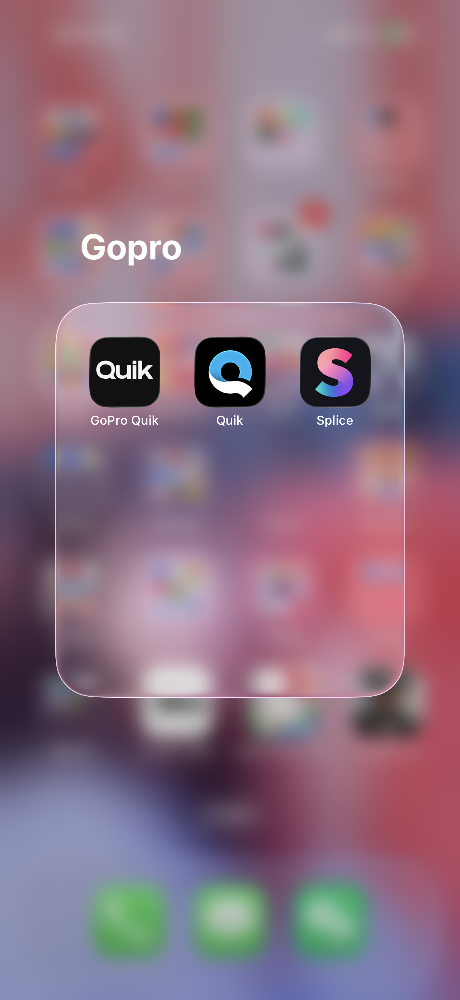

# 玻璃边缘与浅色背景复核

日期：2026-09-11。范围：用户提供的 IMG_3372.PNG 及当前绘制源代码；本次没有启动应用或电脑操作工具，没有新运行截图。以下是参考图观察、代码差距和更新后的验收要求，不是实现完成或视觉验收通过。

## 1. 参考图观察

图像原始尺寸 1320×2868 px，本次查看的是工具显示的缩放预览，未做像素级反推。

- 轮廓有一条很细的亮边，其内侧还有更宽、更柔和的过渡；仅用亮线不能表达图中的厚度。
- 内侧明暗与透射色彩沿边缘变化，没有表现为固定宽度、固定亮度的白色环。圆角与直边之间过渡连续。
- 框体底部及左右边缘附近的局部颜色和亮暗还受到背后内容影响。不能把这些斑块直接当成固定内发光纹理复制。
- 参考背景本身有大量颜色及亮暗变化，因此不能从该图证明纯白背景也能辨识边界；零偏移暗色外扩散按用户本次要求明确加入。

## 2. 当前代码差距

`Sources/GlassFrameLab/FramePanel.swift` 关闭系统阴影，承载视图只有白色填充和白色细边。`Sources/GlassFrameLab/GlassRenderer.swift` 的 fragment shader 将背景统一向白色混合 10%，再以到圆角边界的距离生成统一的白色细边；没有暗色外扩散或沿周长变化的内发光项。

在纯白输入下，继续混合白色仍然得到白色，因此当前实现缺少可靠的明度分离机制。这支持用户指出的浅色背景辨识风险；本次没有把该代码推断称为新运行实测。

## 3. 确认后的绘制层次

| 层次 | 目标表现 | 约束 |
| --- | --- | --- |
| 外侧暗色扩散 | 淡、柔、零偏移，围绕完整圆角轮廓向外衰减 | 单独控制颜色、透明度和扩散宽度；没有硬边或矩形裁切 |
| 玻璃主体 | 模糊并透射真实背景色彩 | 浅色背景不靠继续提白形成厚度 |
| 内侧非均匀光带 | 由边缘向中心衰减，沿周长平滑改变强度和宽度 | 保留大面积清透中心；不铺满 50 pt 高的默认框体，不绘制固定背景色斑 |
| 细边缘高光 | 紧贴轮廓，清晰但克制 | 与宽内发光独立控制，不通过加粗白边替代深度 |

外侧光晕用透明边距承载；800×100 px 指玻璃主体，光晕增加的窗口尺寸必须单独计算并参与屏幕约束。不会添加系统装饰或可见外围底板。右键关闭行为不变。

## 4. 后续实际验证

纯白、近白浅灰、浅暖色、浅冷色、深色及多色背景分别运行，查看默认和较大尺寸；保存完整效果、关闭外扩散、关闭内发光的对照。检查浅色边界、深色背景灰圈、四角连续性、光晕裁切，以及矮框体内部是否被光带填满。参数集中管理，具体数值以真实截图校准；新增视觉效果后的资源与性能需验证，不能直接沿用旧构建的性能结论。

本次只更新需求与复核记录。WP-05 的 BLOCKED_STALLED 和开放恢复时序问题保留，未自动开启 WP-06，也未改动生产渲染代码。
